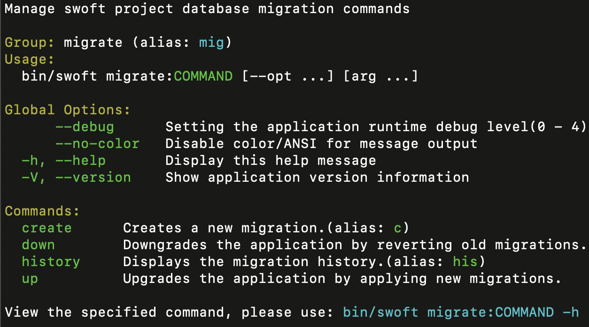
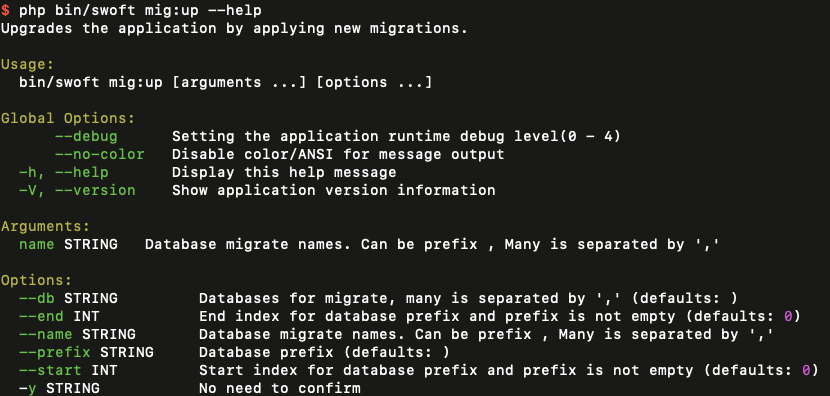
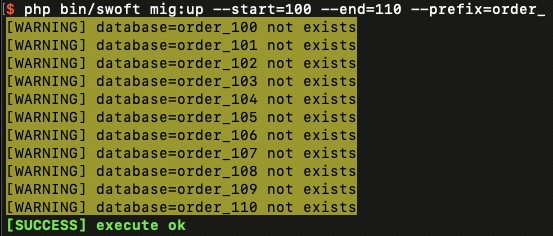
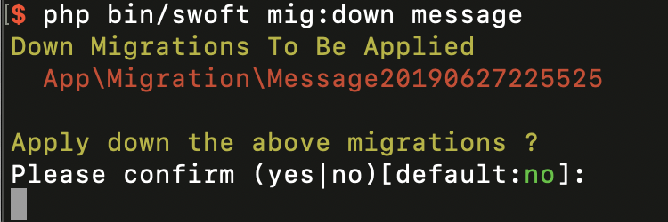

# Swoft 的数据库迁移 Migrations

## 简介

数据库迁移就像是数据库的版本控制，可以让你的团队轻松修改并共享应用程序的数据库结构。迁移通常会搭配上 Swoft 的数据库结构构造器来让你方便地构建数据库结构。如果你曾经出现过让同事手动在数据库结构中添加字段的情况，数据库迁移可以解决你这个问题。

Swoft 的 `Schema` 对所有 Swoft 支持的数据库系统提供了创建和操作数据表的相应支持。

## migrate 命令

    php bin/swoft migrate
        
查看帮助文档
        



### create 迁移生成

使用 `migrate:create` 来创建迁移：

    php bin/swoft migrate:create add_user_age_column

create 参数列表

- name **指定迁移名称**
- y **直接生成 不询问是否需要生成目录/文件**

你也可以使用 `mig:c` 来快速生成


> 同一目录迁移文件不可以重复生成

新的迁移文件将默认会被放置在 `App/Migration` 目录中。每个迁移文件的名称不包含时间戳, 在 `@Migration`默认参数就是,确认迁移的顺序。

如果你想迁移文件放置在 自定义目录下

需要覆盖配置 `migrationManager` Bean 的 `migrationPath` 配置

```php
// in bean.php file

'migrationManager' => [
    'migrationPath' => '@app/Migration',
],
```

## 迁移结构

一个迁移类会包含两个方法： `up` 和 `down` 。 `up` 方法可为数据库添加新的数据表、字段或索引，而 `down` 方法则是 `up` 方法的逆操作。

你可以在这两个方法中使用 Swoft 数据库结构构造器来创建以及修改数据表。若要了解 `数据库结构` 构造器中的所有可用方法，[可查阅它的文档](#数据表)。以下的迁移实例会创建一张 `Messages` 数据表：

```php
<?php declare(strict_types=1);


namespace App\Migration;


use ReflectionException;
use Swoft\Bean\Exception\ContainerException;
use Swoft\Db\Exception\DbException;
use Swoft\Db\Schema\Blueprint;
use Swoft\Devtool\Annotation\Mapping\Migration;
use Swoft\Devtool\Migration\Migration as BaseMigration;

/**
 * Class Message
 *
 * @since 2.0
 *
 * @Migration(time=20190627225525, pool="db2.pool")
 */
class Message extends BaseMigration
{
    /**
     * @return void
     *
     * @throws ReflectionException
     * @throws ContainerException
     * @throws DbException
     */
    public function up(): void
    {
        $this->schema->createIfNotExists('messages', function (Blueprint $blueprint) {
            $blueprint->increments('id');
            $blueprint->text('content');
            $blueprint->timestamps();
        });
    }

    /**
     * @return void
     *
     * @throws ReflectionException
     * @throws ContainerException
     * @throws DbException
     */
    public function down(): void
    {
        $this->schema->dropIfExists('messages');
    }
}
```
迁移必须要继承 `Swoft\Devtool\Migration\Contract\MigrationInterface` 契约

在 基础抽象类 `BaseMigration` 中已经 实现了 `MigrationInterface` 契约

在 `BaseMigration` 中提供了 

- `schema` 属性该属性是一个 `Schema Builder` 提供了 和 `Schema::xxx` 一样的方法 底层会根据 `@Migration`  注解里面的 `pool` 参数选择好连接池 注入到 `schema` 属性中

- 如果需要执行原生 SQL 可以使用 `execute` 方法, 在底层执行迁移的时候 这些 SQL 会被自动执行
```php
    /**
     * @return void
     */
    public function down(): void
    {
        $truncate = <<<sql
truncate `users`;
sql;
        $this->execute($truncate);

        $dropSql = <<<sql
drop table if exists `users`;
sql;
        $this->execute($dropSql);
    }
```

> Swoft 迁移是 每一个文件是一个事务 一个迁移文件中不宜 写太多执行耗时长的 SQL, 以至于写锁等待时间太长, 如果执行中发生了异常 会自动回滚 

### @Migration 注解

迁移注解有两个参数 

- time **时间戳** 
- pool **当前迁移使用的连接池 默认为 `db.pool`**

**time** 参数 是默认是你可以这样使用它 `@Migration(20190630164222)` 该参数必须存在
以便 Swoft 执行迁移

更多 demo 参考 Swoft 主项目下的 `App\Migrations` 目录

## 运行迁移

### 分库的一些支持



在运行 `up`, `down`, `history` 这三个命令的时候 可以上

- `--db=` 指定运行的 `database`, 多个用逗号分隔. 
- `--start=` 开始的 数据库 id
- `--end=` 结束的 数据库 id
- `--prefix=` 指定执行 数据库运行的前缀, 这个参数只会影响 `--db=`, `--start=` , `--end=` 这三个参数的, 如果没有指定 `--prefix=` 会使用连接中的数据库名作为**前缀**

简单分库 假设 后缀编号是自增的 例如:

    php bin/swoft migrate:up --prefix=wx_order --start=1000 --end=1400
    
类似这样的操作会执行 `wx_order_1000` 到 `wx_order_1400` 之间的所有数据库, 如果有些不存在会自动过滤掉



还可以指定要执行的数据库 类似下面这个例子


当然你也可以在迁移脚本的时候 定义 `@Migration` 注解的 `pool` 参数执行的时候也会自动选择对应连接池的连接, 这样也可以实现简单分库

> 前提是你必须使用 系统 `BaseMigration` 提供的 `schema` 属性,`execute` 方法. 才会执行正确, 不然你需要手动自动连接池 

例如下面这样的, 这样不是很方便管理. 如果和定义 `@Migration` 注解的 `pool` 可能就会出问题, 如果需要指定连接池执行, 请使用 上面的 Demo 方式.

```php

    /**
     * @return void
     *
     * @throws ReflectionException
     * @throws ContainerException
     * @throws DbException
     */
    public function down(): void
    {
        Schema::dropIfExists('users');

        Schema::getSchemaBuilder('db2.pool')->dropIfExists('users');
    }
```

### 在线上环境强制执行迁移

一些迁移的操作是具有破坏性的，它们可能会导致数据丢失。为了保护线上环境的数据库，系统会在这些命令被运行之前显示确认提示。若要忽略此提示并强制运行命令，则可以使用 `-y` 标记：

    php bin/swoft migrate:up -y
    
### 执行

使用 `migrate:up`  命令，来运行所有未运行过的迁移：

    php bin/swoft migrate:up

指定名称 执行, 这可能会匹配到多个 底层会 使用 `stripos` 匹配输入的字符在任意位置存在都可以不区分大小写, 下划线也是支持的底层会自动转换成驼峰进行匹配


如果没有匹配到 将会中断执行
 
### 回滚迁移

若要回滚最后一次迁移，则可以使用 `down` 命令。此命令是对上一次最后一个执行的迁移回滚：

    php bin/swoft migrate:down  

在 `down` 命令后加上 `step` 参数，你可以限制回滚迁移的个数。例如，下面的命令将会回滚最后的 5 个迁移。

    php bin/swoft migrate:down --step=5

默认会从 `db.pool` 中获取连接 查询 迁移记录表, 也可以指定连接池 

     php bin/swoft migrate:down --step=5 --pool=db.pool2
  
也可以指定迁移文件 回滚



### 显示迁移历史
显示执行的 up/down 历史

    php bin/swoft migrate:his  
    
    php bin/swoft migrate:history  
    
默认会从 `db.pool` 中获取连接 查询 迁移记录表, 也可以指定连接池 

    php bin/swoft mig:his --pool=db.pool2


## 数据表

### 创建数据表

要创建一张新的数据表，可以使用 `Schema` facade 的 `create` 方法。`create` 方法接收两个参数：第一个参数为数据表的名称，第二个参数为一个 `闭包` ，此闭包会接收一个用于定义新数据表的 `Blueprint` 对象：

    Schema::create('users', function (Blueprint $table) {
        $table->increments('id');
    });

当然，在创建数据表的时候，你也可以使用任何数据库结构构造器的 [字段方法](#字段) 来定义数据表的字段。

#### 检查数据表或字段是否存在

你可以方便地使用 `hasTable` 和 `hasColumn` 方法来检查数据表或字段是否存在：

```php
    if (Schema::hasTable('users')) {
        //
    }

    if (Schema::hasColumn('users', 'email')) {
        //
    }

```
#### 数据库连接与存储引擎

如果你想要在一个非默认的数据库连接中进行数据库结构操作，可以使用 `getSchemaBuilder` 方法：
```php

    Schema::getSchemaBuilder('db.pool2')->create('users', function (Blueprint $table) {
        $table->increments('id');
    });
    
```

你可以在数据库结构构造器上设置 `engine` 属性来设置数据表的存储引擎, Mysql 默认为 `InnoDB` ：

```php
Schema::create('users', function (Blueprint $table) {
        $table->engine = 'InnoDB';

        $table->increments('id');
});
```
    
如果要判断数据表已存在就不创建可以使用 `createIfNotExists` 方法只针对[可用的字段类型](#可用的字段类型)有效其他方法无法判断是否已经被创建过了
    
```php
Schema::createIfNotExists('users', function (Blueprint $blueprint) {
        $blueprint->increments('id');
});
```     

### 重命名与删除数据表

若要重命名一张已存在的数据表，可以使用 `rename` 方法：

```php
 Schema::rename($from, $to);
```

要删除已存在的数据表，可使用 `drop` 或 `dropIfExists` 方法：

```php
Schema::drop('users');

Schema::dropIfExists('users');
```    

#### 重命名带外键的数据表

在重命名前，你需要检查外键的约束涉及到的数据表名需要在迁移文件中显式的提供，而不是让 Swoft 按照约定来设置一个名称。因为那样会让外键约束关联到旧的数据表上。

## 字段

### 创建字段

使用 `Schema` facade 的 `table` 方法可以更新已有的数据表。如同 `create` 方法，`table` 方法会接收两个参数：一个是数据表的名称，另一个则是接收 `Blueprint` 实例的`闭包`。我们可以使用它来为数据表新增字段：

```php
Schema::table('users', function (Blueprint $table) {
        $table->string('email');
});
```    

#### 可用的字段类型

数据库结构构造器包含了许多字段类型，供你构建数据表时使用：

命令  | 描述
------------- | -------------
`$table->bigIncrements('id');`  |  递增 ID（主键），相当于「UNSIGNED BIG INTEGER」型态。
`$table->bigInteger('votes');`  |  相当于 BIGINT 型态。
`$table->binary('data');`  |  相当于 BLOB 型态。
`$table->boolean('confirmed');`  |  相当于 BOOLEAN 型态。
`$table->char('name', 4);`  |  相当于 CHAR 型态，并带有长度。
`$table->date('created_at');`  |  相当于 DATE 型态
`$table->dateTime('created_at');`  |  相当于 DATETIME 型态。
`$table->dateTimeTz('created_at');`  |  DATETIME (带时区) 形态
`$table->decimal('amount', 5, 2);`  |  相当于 DECIMAL 型态，并带有精度与基数。
`$table->double('column', 15, 8);`  |  相当于 DOUBLE 型态，总共有 15 位数，在小数点后面有 8 位数。
`$table->enum('choices', ['foo', 'bar']);` | 相当于 ENUM 型态。
`$table->float('amount', 8, 2);`  |  相当于 FLOAT 型态，总共有 8 位数，在小数点后面有 2 位数。
`$table->increments('id');`  | 递增的 ID (主键)，使用相当于「UNSIGNED INTEGER」的型态。
`$table->integer('votes');`  |  相当于 INTEGER 型态。
`$table->ipAddress('visitor');`  |  相当于 IP 地址形态。
`$table->json('options');`  |  相当于 JSON 型态。
`$table->jsonb('options');`  |  相当于 JSONB 型态。
`$table->longText('description');`  |  相当于 LONGTEXT 型态。
`$table->macAddress('device');`  |  相当于 MAC 地址形态。
`$table->mediumIncrements('id');`  |  递增 ID (主键) ，相当于「UNSIGNED MEDIUM INTEGER」型态。
`$table->mediumInteger('numbers');`  |  相当于 MEDIUMINT 型态。
`$table->mediumText('description');`  |  相当于 MEDIUMTEXT 型态。
`$table->morphs('taggable');`  |  加入整数 `taggable_id` 与字符串 `taggable_type`。
`$table->nullableMorphs('taggable');`  |  与 `morphs()` 字段相同，但允许为NULL。
`$table->nullableTimestamps();`  |  与 `timestamps()` 相同，但允许为 NULL。
`$table->rememberToken();`  |  加入 `remember_token` 并使用 VARCHAR(100) NULL。
`$table->smallIncrements('id');`  |  递增 ID (主键) ，相当于「UNSIGNED SMALL INTEGER」型态。
`$table->smallInteger('votes');`  |  相当于 SMALLINT 型态。
`$table->softDeletes();`  |  加入 `deleted_at` 字段用于软删除操作。
`$table->string('email');`  |  相当于 VARCHAR 型态。
`$table->string('name', 100);`  |  相当于 VARCHAR 型态，并带有长度。
`$table->text('description');`  |  相当于 TEXT 型态。
`$table->time('sunrise');`  |  相当于 TIME 型态。
`$table->timeTz('sunrise');`  |  相当于 TIME (带时区) 形态。
`$table->tinyInteger('numbers');`  |  相当于 TINYINT 型态。
`$table->timestamp('added_on');`  |  相当于 TIMESTAMP 型态。
`$table->timestampTz('added_on');`  |  相当于 TIMESTAMP (带时区) 形态。
`$table->timestamps();`  |  加入 `created_at` 和 `updated_at` 字段。
`$table->timestampsTz();`  |  加入 `created_at` and `updated_at` (带时区) 字段，并允许为NULL。
`$table->unsignedBigInteger('votes');`  |  相当于 Unsigned BIGINT 型态。
`$table->unsignedInteger('votes');`  |  相当于 Unsigned INT 型态。
`$table->unsignedMediumInteger('votes');`  |  相当于 Unsigned MEDIUMINT 型态。
`$table->unsignedSmallInteger('votes');`  |  相当于 Unsigned SMALLINT 型态。
`$table->unsignedTinyInteger('votes');`  |  相当于 Unsigned TINYINT 型态。
`$table->uuid('id');`  |  相当于 UUID 型态。


### 字段修饰

除了上述的字段类型列表，还有一些其它的字段「修饰」，你可以将它增加到字段中。例如，若要让字段「nullable」，那么你可以使用 `nullable` 方法：

```php
Schema::table('users', function (Blueprint $table) {
        $table->string('email')->nullable();
});
```

以下列表为字段的可用修饰。此列表不包括 [索引修饰](#索引)：

Modifier  | Description
------------- | -------------
`->after('column')`  |  将此字段放置在其它字段「之后」（仅限 MySQL）
`->comment('my comment')`  |  增加注释
`->default($value)`  |  为此字段指定「默认」值
`->first()`  |  将此字段放置在数据表的「首位」（仅限 MySQL）
`->nullable()`  |  此字段允许写入 NULL 值
`->storedAs($expression)`  |  创建一个存储的生成字段 （仅限 MySQL）
`->unsigned()`  |  设置 `integer` 字段为 `UNSIGNED`
`->virtualAs($expression)`  |  创建一个虚拟的生成字段 （仅限 MySQL）

### 修改字段

#### 重命名字段/修改字段属性

要重命名字段，可使用数据库结构构造器的 `renameColumn` 方法。

```php
Schema::table($table, function (Blueprint $blueprint) {
   // Rename column
   $blueprint->renameColumn('id', 'user_id', 'bigint', 20);
});
```

### 移除字段

要移除字段，可使用数据库结构构造器的 `dropColumn` 方法。

```php
Schema::table('users', function (Blueprint $table) {
    $table->dropColumn('votes');
});
```    

你可以传递多个字段的数组至 `dropCloumn` 方法来移除多个字段：

```php
Schema::table('users', function (Blueprint $table) {
    $table->dropColumn(['votes', 'avatar', 'location']);
});
```    

> {note} SQLite 数据库并不支持在单个迁移中移除或修改多个字段。

## 索引

### 创建索引

数据库结构构造器支持多种类型的索引。首先，让我们先来看一个示例，其指定了字段的值必须是唯一的。你可以简单的在字段定义之后链式调用 `unique` 方法来创建索引：

```php
$table->string('email')->unique();
```   

此外，你也可以在定义完字段之后创建索引。例如：

```php
$table->unique('email');
```

你也可以传递一个字段的数组至索引方法来创建复合索引：

```php
$table->index(['account_id', 'created_at']);
```

Swoft 会自动生成一个合理的索引名称，但你也可以使用第二个参数来自定义索引名称:

```php
$table->index('email', 'my_index_name');
```

#### 可用的索引类型

Command  | Description
------------- | -------------
`$table->primary('id');`  |  加入主键。
`$table->primary(['first', 'last']);`  |  加入复合键。
`$table->unique('email');`  |  加入唯一索引。
`$table->unique('state', 'my_index_name');`  |  自定义索引名称。
`$table->unique(['first', 'last']);`  | 加入复合唯一键。
`$table->index('state');`  |  加入基本索引。

#### 索引长度 & MySQL / MariaDB

Swoft 默认使用 `utf8mb4` 字符，包括支持在数据库存储「表情」。如果你正在运行的 MySQL release 版本低于5.7.7 或 MariaDB release 版本低于10.2.2 ，为了MySQL为它们创建索引，你可能需要手动配置迁移生成的默认字符串长度， `Schema::defaultStringLength` 方法来配置它：

```php
Schema::defaultStringLength(191);
```   

或者你可以为数据库开启 `innodb_large_prefix` 选项，有关如何正确开启此选项的说明请查阅数据库文档。

### 移除索引

若要移除索引，则必须指定索引的名称。Swoft 默认会自动给索引分配合理的名称。其将数据表名称、索引的字段名称及索引类型简单地连接在了一起。举例如下：

命令  | 描述
------------- | -------------
`$table->dropPrimary('users_id_primary');`  |  从「users」数据表移除主键。
`$table->dropUnique('users_email_unique');`  |  从「users」数据表移除唯一索引。
`$table->dropIndex('geo_state_index');`  |  从「geo」数据表移除基本索引。

如果你对 `dropIndex` 传参索引数组，默认的约定是索引名称由数据库表名字和键名拼接而成：

```php
Schema::table('geo', function (Blueprint $table) {
    $table->dropIndex(['state']); // 移除索引 'geo_state_index'
});
```

### 外键约束

Swoft 也为创建外键约束提供了支持，用于在数据库层中的强制引用完整性。例如，让我们定义一个有 `user_id` 字段的 `posts` 数据表，`user_id` 引用了 `users` 数据表的 `id` 字段：

```php
Schema::table('posts', function (Blueprint $table) {
        $table->integer('user_id')->unsigned();

        $table->foreign('user_id')->references('id')->on('users');
});
```    

你也可以指定约束的「on delete」及「on update」：

```php
$table->foreign('user_id')
          ->references('id')->on('users')
          ->onDelete('cascade');
```

要移除外键，你可以使用 `dropForeign` 方法。外键约束与索引采用相同的命名方式。所以，我们可以将数据表名称和约束字段连接起来，接着在该名称后面加上「_foreign」后缀：

```php
$table->dropForeign('posts_user_id_foreign');
```

你也可以传递一个包含字段的数组，在移除的时候字段会按照惯例被自动转换为对应的外键名称：

```php
$table->dropForeign(['user_id']);
```

你可以在迁移文件里使用以下方法来开启和关闭外键约束：

```php
Schema::enableForeignKeyConstraints();

Schema::disableForeignKeyConstraints();
```    